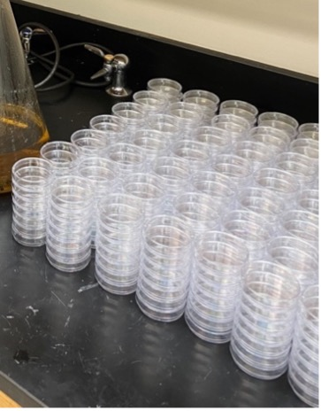
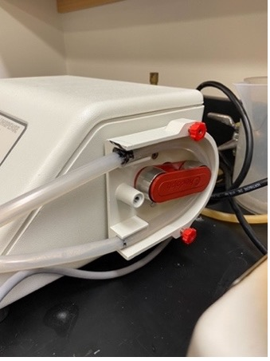
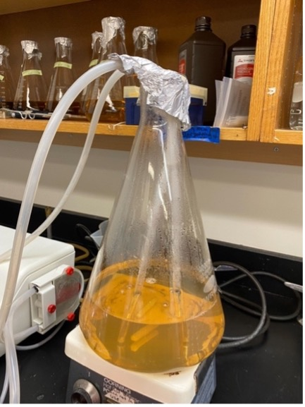
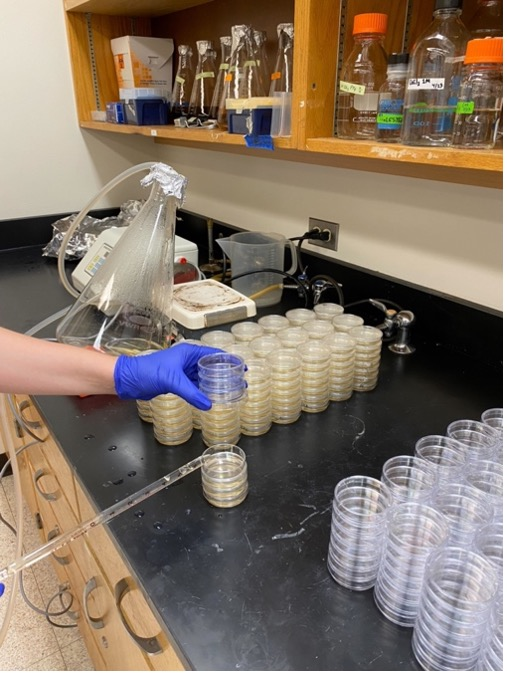

# Plate Pouring Protocol: NGM and HGMA

## General notes:

  - 6 cm plates take 13.5 mL of solution
  - 10 cm plates take 32.5 mL of solution

  - **Number of plates poured per volume of NGM**

     | 1 L of NGM | 2 L of NGM |
     | ---------- | ---------- |
     | ~65 6 cm plates | ~130 6 cm plates |
     | ~30 10 cm plates | ~60 10 cm plates |

## Preparing NGM and HGM Media Mixes

- The dry ingredients for the media can be pre-measured into the plastic bottles labeled "For NGM Prep" (Shelf 2). Label the bottle with a piece of tape stating: Type of media and final volume (e.g., NGM-1L or NGM-2L), date of preparation, and your initials.

- **NGM recipe**

    | Reagent | 1 L | 2 L |
    | ------- | --- | --- |
    | Peptone | 2.5 g | 5 g |
    | NaCl | 3 g | 6 g |
    | Agar | 17 g | 34 g |
    | Sterile water | 975 mL | 1950 mL |

    **Note:** if pouring NGMA plates, add 7 g of Agarose and 10 g of Agar per 1 L of media.

- **HGM recipe**

    | Reagent | 1 L | 2 L |
    | ------- | --- | --- |
    | Peptone | 20 g | 40 g |
    | NaCl | 3 g | 6 g |
    | Agar | 20 g | 40 g |
    | Sterile water | 975 mL | 1950 mL |

    **Note:** if pouring HGMA plates, add 8 g of Agarose and 12 g of Agar per 1 L of media.

## Preparing Media for Pouring

1. Combine all reagents in a flask that can hold 2X the volume of your media.

      a. Put a plastic funnel in the mouth of the flask.

      b. Dump the contents of the bottle into the flask.

      c. Pour sterile water into the bottle and swirl to get any powder reagents off the sides.

      d. Pour the water from the bottle into the flask, making sure to rinse any powder stuck on the funnel into the flask.

      e. Repeat steps c and d until you've poured in all the sterile water.

1. Cover the mouth of the flask with foil and tape in place with autoclave tape (autoclave room). Use label tape to label the flask with: media (e.g. NGM or HGM), date of pour, and your initials. **Note:** you can simply move the tape label from the plastic bottle to the flask, making sure to also write the date of pour on the label.

4. Add stir bar.

5. Autoclave the following with a 60 min. liquid cycle:

    a. 1 L H2O in a 1 L bottle.

    b. Liquid dispenser hoses capped and wrapped with aluminum foil.

    c. NMG or HGM media.

6. Turn on the water baths in lab room 230 and set temperature to 55°C while the media is still in the autoclave. Once sterilization of media is complete, bring the flask to the lab and allow it to cool to 55°C in the water bath for at least an hour (maximum of four hr.) and then add the following to the media **in the exact order listed**. Gently swirl to mix after addition of each reagent.

    | Reagent | 1 L | 2 L |
    | ------- | --- | --- |
    | 1 M KH2PO4 (K Phosphate Buffer) | 25 mL | 50 mL |
    | Cholesterol (5 mg/mL in Ethanol) | 1 mL | 2 mL |
    | 1 M CaCl2 | 1 mL | 2 mL |
    | 1 M MgSO4 | 1 mL | 2 mL |

    **Note:** If these solutions are already made, make sure they are autoclaved (except Cholesterol) or filter-sterilized before adding to the media.

## Operating the PourBoy

1. Things you will need to autoclave before PourBoy use:

  - PourBoy input and output tube: wrap the tube openings with foil, then fold the tubes up and wrap both tubes together in foil. Place autoclave tape on the wrapping.

  - 1 L sterile water (for cleaning of the PourBoy prior to use)

2. Once autoclaved, remove foil from one end of one of the tubes (tube 1) and connect that end to the input port (refer figure), then remove foil from one end of the other tube (tube 2) and connect that end to the output port.

3. Run 200 mL of hydrogen peroxide through the PourBoy.

4. Check PourBoy settings. Use the "POUR" up and down buttons to set the volume that must be dispensed into each plate Press and release the "MODE/CAL" button to switch between Manual mode (dispenses once per foot pedal operation) and Auto mode (dispenses indefinitely, with a pause interval between dispensing operations). Use the "PAUSE" up and down buttons to increase and decrease the interval between dispensing operations in auto mode. Foot pedal is hard-wired to the PourBoy pump and you should not attempt to remove it.

    **Note:** Be very careful with the ends of the tubes from this point forward. They are sterile and must be kept sterile while pouring plates. Do not allow them to touch anything but the inside of the autoclaved media, water, or aluminum foil.

5. Place the autoclaved bottle of water on the hot plate (setting 4/5).

6. Remove the foil from the other end of tube 1 and lower the tube into autoclaved water (<100°C). Remove foil from the other end of tube 2 and hold over a plastic jug to collect dispensed water. Ensure that the tube does not touch the sides of the non-sterile jug. Use the foot petal to pass water through the tubes to sterilize the pump drive coil. Use a plastic receptacle (Shelf 5) as a waste container for water/media.

7. Once you've passed ~300-400 mL of water, switch tube 1 to the flask with media (bring to room 223 from the water bath in room 230), kept on the hot plate. Once the tube is in the flask, cover the mouth of the flask with foil. Bring the water to the water bath.

    

8. Wipe down the working area with 70% ethanol and then spread individual plates out on the table.

    

9. While holding the lid of a plate open, move the dispensing end of tube 2 over the plate and use the foot pedal to dispense the set volume of media. Then move on to the next plate. **Be sure not to touch the tip of the tubing onto any part of the plate.**

    

10. Throughout the plate pouring procedure, remember to watch the flask to ensure that the media is getting into the tubing even when there is only a small volume of media left in the flask. If the opening of the tubing is not completely covered by media,  air will get into the tubing, which results in bubbles in the plates. **Plates with bubbles are not usable.** Tip the flask to the side to pour out the last few plates. Stop the pouring if there is not enough media left (less than the volume for one plate).

    

11. Once the desired number of plates have been poured, switch tube 1 from the flask with 200 mL of hydrogen peroxide and run entire volume through. Then, switch to the bottle with hot water (switch the water with the media flask on the hot plate to heat up the water) and foot pedal 300-400 mL of water through the PourBoy to flush out media before it solidifies in the tubes and pump drive coil.

12. Once all plates are **solidified** (~15 min. for 6 cm plates and ~30 min. for 10 cm plates) stack them up (**lid-side up**) and use labelling tape to label them with the name of media, name of the person that poured the plates, time, and date.

13. Leave plates stacked on benchtop for two days. Place in a clean a plastic box wiped down with 70% ethanol (wipe down all sides of the box until dry). Then stack the poured plates in the box, **lid-side down**. Transfer the labelling tape form step 9 to the box.

    

14. Store the box in the 4°C deli-style fridge.

  **Note:** When pouring many plates, there is not enough room on the bench to fit all of the plates in the media. To maximize space, you can stack 3-4 plates on top of each other and pour from the bottom up of each stack. When done with a stack, place the flask of media back in the 55°C water bath, and wait for the plates to dry (20-30 min.). Once dry, stack all of the plates on the right end of the bench and place out more stacks of plates to pour. Continue and repeat until all of the media has been poured.

  | Plate Storage |
  | ------------- |
  | ~240 6 cm plates fit in one large plastic box |
  | ~70-80 plates fit in one large plastic box |

  

## Pourboy Configuration

  

## Operating the Wheaton Unispense

  1. Things you will need to autoclave before Unispense use:
    - Tubing with glass rods on either end: wrap glass rods in foil, then fold the tubes up and wrap the entire tube up in foil. Place autoclave tape on the wrapping.
    - 1 L sterile millliQ water (for rinsing the tubing after use)
    

  2. Wipe down the working area with 70% ethanol and then spread individual plates out on the table. If you are pouring a large quantity, make stacks up to 7 high.

  

  3. It is very important to ensure the machine is OFF for this step. To set up the tubing, look for the two black marks on the plastic tube and line them up with the edges of the tube slot (as seen below). The side with the shorter distance between the black mark and glass rod should be on the bottom. Make sure the tubing is flush with the side of the machine.

  

    **Note:** do not take the foil off either glass apparatus during the next step, they must be kept sterile.

  4. Next, hook the clear guard on the two red screws with the straight end facing you, and tighten the red screws. Screw the white guard on to hold the tubes in place (see image below for setup).

  

    **Note:** keep the flasks covered in foil at all times to prevent contamination.

  5. Take one of the flasks out of the water bath and place on the hot plate. Turn on the heat to low and turn on the stirrer for ~ 1 minute to make sure the media is homogenous. Turn off the stirrer.

  6. Next, carefully, and without touching the glass apparatuses to anything, take the foil off both glass apparatuses and insert them into one of the flasks filled with the plate media. Both apparatuses should be touching the bottom of the flask to ensure no air bubbles are sent through the tubing. Keep the foil on top of the flask to prevent contamination.

  

  7. Turn on the machine .

  8. Press the auto/man button twice. The screen should now say AUTOMATIC. If it says MANUAL, press the button once more so that it says AUTOMATIC. Press start and the tubes will prime. Watch to make sure the ends of the glass apparatuses remain submerged in the media. Watch the top of the glass apparatuses for bubbles. If an air bubble persists, pinch the plastic part of the tube to push out the air bubble.

  

  9. Once the tubes are filled and contain no air bubbles, press stop.

  10. Press the auto/man button to return to manual.

  11. Set the foot pedal on the floor.

  12. Take the glass apparatus with the long tubing out of the flask, being careful not to touch it on anything, as it must be kept sterile. As you are taking it out of the flask, keep it as level as possible.

  13. While holding the lid of a plate open, move the dispensing end of the glass apparatus over the edge of the plate nearest to you and use the foot pedal to dispense the set volume of media. Then move on to the next plate. **Be sure not to touch the tip of the glass apparatus onto any part of the plate.**

    - Holding it here instead of over the middle of the plate avoids bubbles and splashing.
    - If you get air bubbles in the plate, use the edge of the lid to tap the bubbles and pop them if possible.

    

  14. Throughout the plate pouring procedure, remember to watch the flask to ensure that the media is getting into the tubing even when there is only a small volume of media left in the flask. The glass apparatus should always be on the bottom of the flask. You should hear the click of the glass apparatus on the bottom of the flask. If the opening of the tubing is not completely covered by media, air will get into the tubing, which results in bubbles in the plates. **Plates with bubbles are not usable.**

  15. Tip the flask to the side to pour out the last few plates. Stop pouring if there is not enough media left (less than the volume for one plate).

  

  16. If you are pouring multiple flasks, prime each time you switch between flasks. To switch flasks, remove flask from water bath and place on hot plate. Run stirrer for ~10 seconds to homogenize mixture. Take the glass apparatuses out of the old flask and, without touching them on anything, transfer them both to the new flask. Switch the machine back to automatic. Ensure the bottom of the apparatuses are completely submerged in media and run on automatic until no bubbles remain in the tubing.

    - If the glass apparatuses touch anything and get contaminated, sterilize them using a Bunsen burner flame before you put them in a new flask, but try to avoid this as much as possible.

  17. When finished with the last flask, pour the 1 L sterile water into the empty flask. Put the glass apparatus used for pouring into the empty flask as well. Run the machine on automatic for ~3 minutes.

  18. Shutdown: turn off the machine before moving on.

  19. Unscrew and remove both the clear and white tubing guards. Remove the tubing.

  20. Rub off any agar on the outside of the glass apparatuses with distilled water from the sink. Throw agar in the trash, do NOT let it go down the sink. Use the brush to scrub the insides of the glass apparatuses to get rid of any agar.

  21. Wrap the two glass apparatuses in foil and then full tubing in foil. Turn off the water bath.

## Troubleshooting

  1. The agar is cracking
      - this probably means the plates were left out to dry too long
      solution: decrease the drying time

  2. The OP50 is crusty or is a film ("skating rink")
      - this means the plates got too hot while the OP50 was drying
      solution: dry in a cooler area

  3. Footballs
      - usually occurs because of problems with the chemicals (1 M KH2PO4, Cholesterol, 1 M CaCl2, and 1 M MgSO4)
      solution: make new solutions
