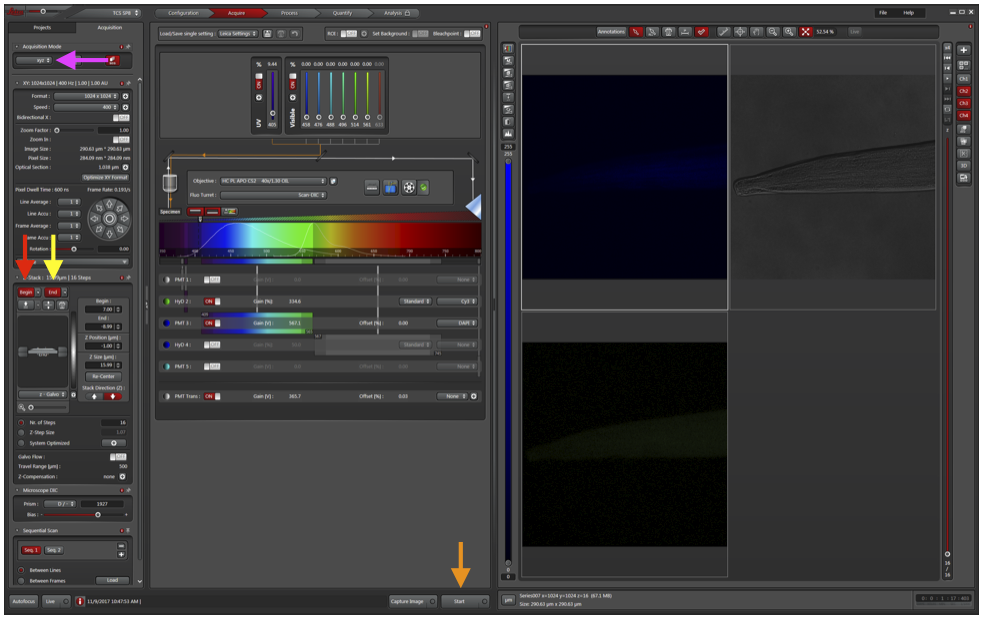

# Confocal Microscopy

1. Reserve confocal time on the Confocal Microscope calendar (email leandro.teixeira@wisc.edu to be added).

    a. When adding your time to the calendar, you must include which lasers you will be using in the description section of the calendar event. This will allow the user before you to know which lasers to leave on when they depart.

2. Get key to the confocal room (labeled in black) from Kathy or Kendra.

3. Go to confocal room (#2433) in SVM.

4. Turn on the 5 buttons/switches in order (1-5).

5. Login using your SVM login information (email
leandro.teixeira@wisc.edu beforehand to ensure you have access to
the computer).

6. Open LAS X

7. Retain the default settings (Config: machine; Microscope: DMI9000;
Resonant: Off; Customized Settings: Off). Press OK.

8. Select “No” when asked to initialize the stage (unless you are doing
tile-scanning).

9. To load your slide onto the microscope, push the top of the microscope
back and adjust the stage to lock in the slide.

10. Microscope use:

    a. Change the objective using LAS X (40x and 60x are oil immersion).

    b. If using an oil immersion objective, add a SMALL amount of Leica type F immersion oil to the lens or the cover glass (3 mm diameter dot)

    c. Move the stage with the knobs to the right of the scope.

    d. Buttons on the front of the scope allow you to open or close the
shutter, as well as change the wavelength of the epifluorescence.

    e. Before initializing the laser and confocal settings, manually use the
ocular to locate the region to be imaged.

11. Initialize the laser:

    a. In the top toolbar, click the Configuration button (red arrow).

    b. Turn all four lasers ON (you should hear the laser boot up and the
fan begin to spin), and the argon laser power between 40-60%.

12. To change the laser settings, click Acquire (green arrow).

    a. Press the third button to the right of Specimen (blue arrow) to open the laser settings.

    b. In Laser Settings, add DAPI and Cy3 (or other) wavelengths. Always use both HyD detectors (much higher sensitivity). If you have more than 2 fluorophores, prioritize the two weakest for HyD and use PMT for DAPI.

    c. Click Apply for Line sequential. This will capture images for each laser sequentially to limit bleed through.

    

13. To begin to acquire an image, return to the Acquire panel and click Live (orange arrow).

    a. To see DIC in addition to DAPI and Cy3, change Fluo Turret (pink arrow) to include DIC.

    b. Ensure all detectors are ON (DAPI PMT, Cy3 HyD, PMT Trans for DIC).

    c. Laser intensity (orange box) should be about 5% for DAPI and 0.5% for all other colors.

    d. To help with adjusting gain, click Live (orange arrow) to visualize the tissue and click “saturation control” (cyan arrow). Blue pixels are saturated. Adjust the gain so that only a few saturated pixels remain in each detector.

    e. Increase Format and Frame Average (red box) to increase the amount of data per area of the image and number of images taken per slice. Can also click “Optimize XY Format” to get the theoretical maximum resolution.

    f. To reduce field of view and increase resolution, click “Zoom In” and draw a box around the region of interest.

    g. If the signal is low, increase frame accumulation. You can also decrease laser power and increase frame accumulation if you are worried of photobleaching.

    h. Turn on “Bidirectional X” to increase scan speed.

    i. Turn off Live.

14. Click Capture Image (red arrow).

15. To perform optical slicing (z-stack):

    a. First reduce the format and remove averaging (to allow for faster
optimization of settings).

    b. Change Acquisition Mode to xzy (magenta arrow).

    c. Adjust the dotted line to cross through an area of fluorescence.

    d. Change Acquisition Mode back to xyz.

    e. Move a dotted line to the top of the fluorescence and click Begin
(red arrow).

    f. Move a dotted line to the bottom of the fluorescence and click End
(yellow arrow).

    g. Click Live.

    h. Adjust number (Nr.) of steps or Z-Step Size to change how many images should be in the stack.

    i. Change back to the desired format and averaging.

    j. Click Start (orange arrow) and back away from the microscope (or
step out of the room, this may take a few minutes). Bumping the microscope can ruin the entire stack if the images don’t properly align.

16. Click Project at the top-left toolbar to see all the images captured and save those you would like to keep.

## Clean-Up and Shutdown Procedure

17. Clean the oil off of the objectives by allowing the paper to soak; DO NOT RUB. and spin the objectives all the way down (with the focus knob).

18. Check the Google calendar to see which lasers the next user will need.

19. If someone is scheduled within the next two hours:

    a. Open the Configuration tap, go to Laser Config, set the argon laser
power to 0%, and turn off any lesser that won’t be used for the next
person.

    b. Exit LAS X and logoff of the computer, but do not turn the computer
off.

    c. Leave switches 1-5 on.

20. If you are the last person of the day or no one is scheduled within the next two hours:

    a. Open the Configuration tap, go to Laser Config, set the argon laser power to 0%, and turn off all lasers.

    b. Exit LAS X and shutdown the computer.

    c. Turn off #1, #2, #3.

    d. Wait for the argon laser cooling fan to turn off, then turn off #4. 21. Turn off the buttons/switches in the opposite manner. Make sure the computer shuts all the way down.

22. Lock the room when you leave and return the key!
