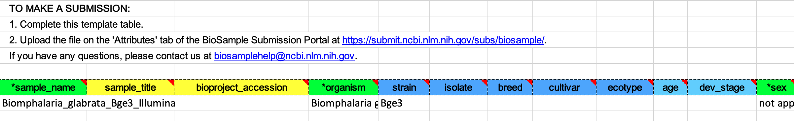

# Date Upload to NCBI

1. Prepare files for data upload.

    a. Ensure proper and informative nomenclature.

    b. Compress files with gzip.

2. Navigate to the SRA [submission portal](https://submit.ncbi.nlm.nih.gov/subs/sra/).

    a. Login or sign-up for an NCBI account.

3. Use an SFTP client (e.g., Transmit, CyberDuck) to preload files:

    a. On the SRA submit page, click the box that says FTP upload.

    b. In your SFTP client, connect to the server using the provided address, username, and password.

    c. Use the SFTP client to navigate to the provided account folder.

    d. Make a new folder with a name that describes the submission (such as `brugia_tissue_rna`).

    e. Drag and drop the sequencing files (in FASTQ or BAM format) into the new directory.

4. Once the preload is complete, click “New submission” on the SRA wizard home page.

5. Complete the Submitter section and click “Continue.”

    

6. Complete the General Info section and click “Continue.” Unless you are updating previous data, you will probably need to select "No" for both the BioProject and BioSample panes. For “Projected release data,” choose the date that you plan to release a pre-print and submit to a journal.

    

7. Complete the Project Info section and click “Continue.” Include a short but descriptive “Public Description” that will complement the abstract of the ensuing manuscript. If reference data came from a database external to NCBI, include the link in “External Links.”

    

8. Complete the BioSample Type section. Consult previous BioSamples for guidance. For example, previously deposited *Biomphalaria glabrata* samples have been designated as “Model organism or animal” (red arrow) while our *Brugia malayi* use the "Invertebrate" designation. To the best of your ability, attempt to maintain consistency with deposited samples from similar sources.

9. In the BioSample Attributes section, download the provided Excel file and complete it.

    

10. In the BioSample Attributes section, click “Choose File” and select the previously saved Excel file. Click “Continue” after the file finishes uploading.

11. Complete the SRA Metadata section. The filenames should match the preloaded filenames.

    

12. Complete the Files section. Click “I have all files preloaded for this submission.” Click “Select preload folder.” If you have followed these instructions correctly, the files that you preloaded should appear in the box that appears, and these files should match the filenames that you entered in the SRA Metadata selection. Select the proper folder.

    

13. Ensure everything has been input properly in the Overview section. When satisfied, click finish. You will receive confirmation emails shortly that provide the BioProject and BioSample accession numbers.

14. Save the BioSample Attributes and SRA Metadata XLSX files in `Box/ZamanianLab/SeqLibraries/SRA`
