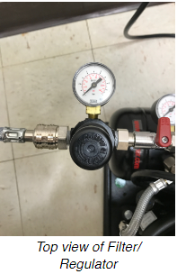
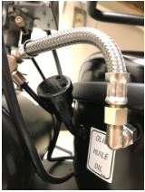
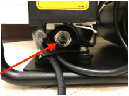

# Injection Rig Preparation

## Compressor

Adapted from [Panther Air Compressor](../Injection_Rig_Preparation/PantherAirCompressor.pdf)  

1. Turn the knob on the automatic ON/OFF - Pressure Switch to the ON position. The compressor will automatically start and stop to maintain the preset pressure level, but the compressor should remain ON until you are finished using the compressor.

    

2. After the compressor has run for a complete cycle to pressurize the tank and then shut off (you will hear the motor stop when it automatically shuts off; tank pressure should be ~120 psi), set the desired pressure on the Filter/Regulator (see image below) by lifting the knob until it clicks/unlocks and the adjust the pressure by turning the knob clockwise (increased pressure) or counterclockwise (decreased pressure). Ensure the read valve is flipped to "ON" to allow air to travel from the tank to the Filter/Regulator. Once the desired pressure is reached, push the knob back down to lock it.

    **NOTE:** Never completely open (turn all the way clockwise) the Filter/Regulator. The FemtoJet can only handle pressures from 60-120 psi, so do not allow the pressure to exceed 120 psi.

3. When injections are complete, turn the compressor off and release the pressure by adjusting the Filter/Regulator to 0 psi and depressurizing through the drain valve (see **Maintenance**).

    

## FemtoJet 4x

Adapted from [FemtoJet 4x](../Injection_Rig_Preparation/FemtoJet4x.pdf)

1. Ensure the compressor is properly setup and connected.

2. Remove the injection tube.

3. Switch on the Microinjector with the main power switch on the back of the machine.

4. Allow the machine to execute the self-test.

5. Perform a test injection:

    a. Fill the capillary with fluorescent dye.

    - i. Fill the microloader with fluorescent liquid.

    - ii. Equip the capillary with the microloader.

    - iii. Insert the capillary into the universal capillary holder.

    b. Carry out a test injection.

    - i. Connect the injection tube.

    - ii. Define the lower safety limit on the micromanipulator.

    - iii. Position the capillary above the cell/worm/egg/etc.

    - iv. Press the prog 1 key.

    - v. Press the inject key or press the foot petal.

    - vi. Check the injection visually.

    - vii. Troubleshoot until the injection parameters are optimized.

    c. After troubleshooting and optimizing, set the compensation pressure pc with Rotary Knob 3.

    d. Set the injection pressure pi with the Rotary Knob 1.

    e. Set the injection time ti with Rotary Knob 

6. Perform the injections.

7. Turn off the Microinjector:

    a. For short intermissions, the microinjector can be put in Standby Mode by pressing the top-left power button on the front of the machine.

    b. To completely turn off the machine, use the main power switch in the back.

    

## Maintenance

1. Air Intake Filter

    a. Unplug the power cord.

    b. Pull the Air Intake Filter out of the suction tube.

    c. If the insert is dirty, wash with soapy water or replace.

    d. Reinstall the Air Intake Filter.

    

2. Moisture Trap

    a. Check the bowl (red arrow) at the bottom of the Filter/Regulator for moisture.

    b. Remove moisture by pressing up the valve core at the bottom of the bowl.

    c. Before cleaning the bowl, ensure the Filter/Regulator is depressurized.

    

3. Pressure Tank

    a. Unplug the compressor and release all the compressed air from the tank by opening the drain valve (red arrow).

    b. Tilt the unit towards the plug to allow the water to drain.

    

4. Oil Change

    a. Unplug the power cord.

    b. Drain the tank by slowly opening the drain valve.

    c. Remove the Air Intake filter.

    d. Tilt the compressor and drain all the oil through the suction tube (tube that Air Intake Filter attaches to) into a container.

    e. Refill with new oil through the suction tube until oil is midway up the oil sight glass (red arrow).

    f. Reinstall the Air Intake Filter.

    

## Periodic Maintenance

1. Daily
  - Check the water in the pressure tank.

2. Weekly
  - Check the moisture trap for moisture.

  - Drain the pressure tank.

3. Monthly
  - Drain the air hose.

  - Check the air filter.

  - Wipe down the FemtoJet 4x
