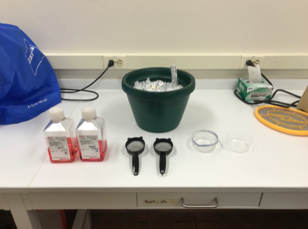

# Extraction of *Brugia* or *Dirofilaria* L3 from Infected Mosquitoes

**Note**: If working with *Brugia* infected mosquitoes, all members of the Zamanian and Bartholomay lab need to be notified 24 hours in advance. Screened-in room will need to be reserved and scheduled on the Google calendar Injection Schedule prior to BSL2 work. Before bringing out the mosquitoes from the insectary, place BSL2 signs on all entrances to the lab and to the screened dissection room. Put on PPE (lab coat, goggles and gloves).

## A. Bulk Extraction of L3
### Materials
- RPMI-1640 (Sigma-Aldrich R8758)
- 2.5 inch strainer (B00428M7OI)
- Porcelain mortar/pestle
- Ziploc disposable plastic dishes 8oz (top cut off)
- Pen-Strep 100X stock (10,000 U/mL)
- Ice bucket

    

### Methods
1. Make 500 mL RPMI + P/S. Place 250 mL in the fridge and one at 37°C.

2. Cold anesthetize the mosquitoes in the cartons by placing the cartons in 4°C refrigerator for about 2-4 min., or until knocked down. You can put up to ~600 mosquitoes in the mortar, so combine the cartons as needed. When all mosquitoes are knocked down, quickly transfer all mosquitoes in the carton to the mortar.

    - **Note**: L3 health after extraction is directly related to how long they are cold in the mosquitoes. Be careful not to leave infected mosquitoes in the fridge for too long; it is a good idea to check the carton every 30 s. Note that anesthetized mosquitoes can still cling to the side of the cardboard.

    

3. Using the pestle, gently tap the mosquitoes to disrupt the cuticle. Do not grind or over tap; more is not better. Gently tap until only a few intact mosquitoes are remaining.

    

4. Transfer the mosquitoes to the mesh strainer and place the strained into a Ziploc plastic dish containing cold RPMI + P/S + G (dish should be ~ half full of media). Dip the strainer up and down 3-5 times to remove scales, eggs, etc (the media should appear cloudy). Do not dip too much as you can lose the L3s in the strainer.

    

5. Discard the media and add clean cold RPMI + P/S to the dish (1/2 full) and dip up and down 3-5x to further rinse the L3s in the strainer.

6. Transfer the strainer of L3s to a clean second dish containing warm RPMI + P/S (40-50 mL, enough to cover the L3s) and incubate at 37°C for *Brugia spp.* or 39°C for *Dirofilaria* for 30 min. The incubation time will allow the L3s to migrate out of the strainer and into the warm RPMI-1640.

    

7. Remove strainer from dish and transfer all L3s (which have migrated into the warm media) into a Petri dish containing a small amount (~20 mL) of fresh, warm RPMI + P/S.

8. Count the total number of L3s harvested and from how many mosquitoes crushed, and aliquot L3s as necessary. L3s should be transferred to [complete L3 media](../General_Parasite_Culture/General_Parasite_Culture.md) for incubation.

9. Once the extractions are complete, rinse and wash all materials used. Dispose of the used plates in the biohazard bin. Do not throw away the sieve or Ziploc dishes.

## B. Extraction of L3 via Dissections
### Materials
- 1X *Aedes* saline (10X recipe below)  
- Glass slides  
- Dissection probes  
- Disposable transfer pipettes   
- Heat block  
- Bucket of ice  
- Glass Petri plate with filter paper   
- Forceps  
- KimWipes   
- 1.5 mL Eppendorf tubes   
- 6 cm Petri dish containing pre-warmed RPMI-1640 + P/S

### Methods
1. Clean and ethanol the work area, stage of dissecting scope, and tools prior to starting the dissections.

2. Warm the heat block to 37°C.

3. Aliquot 1X *Aedes* saline into 1.5 mL Eppendorf tubes. Place tubes in heat block.

4. Under sterile conditions, aliquot ~10 mL of pre-warmed RPMI + P/S into a small 6 cm Petri dish. Place the Petri dish on top of the heat block to keep the media warm.

5. Place a large glass Petri dish lined with filter paper on ice. Cold anesthetize the mosquitoes as described above and transfer to the dish on ice.

6. Take a clean glass slide and in the center add a puddle of 1X *Aedes* saline using a transfer pipette.

7. Using a dissecting probe or a forceps, transfer one adult female mosquito to the pool of saline. Use the dissecting probes to decapitate the mosquito. You may notice L3 beginning to migrate out of the back of the head.

8. Pierce the mosquito head with one probe and use another probe to slice down the mosquito proboscis cutting it open. This will allow the L3 to escape the mouth parts.

9. Allow the dissected head and mouthparts to incubate in the saline for a few minutes to allow all the L3 to migrate into saline.

10. Once all L3 are in saline, individually transfer the L3 into the Petri dish containing the warm RPMI-1640 using a small worm hook (dissecting probe that has been curved into a small hook) or a p20 pipette.

11. Once all L3 have been transferred, place the dish of RPMI-1640 containing L3 back on the heat block and wipe off the slide on the glass slide with a Kimwipe. The slide can be reused.

12. Repeat the above process until all mosquitoes have been dissected or until enough L3 have been collected.

13. If there are undissected mosquitoes remaining, dump mosquitoes into an old mosquito carton and place it in the freezer. Discard spent tubes of media, Kimwipes and slides in the proper biohazard bins. Place Petri dish of L3 in the 37°C incubator until ready to use. Discard ice, take down BSL-2 signage, and ethanol clean the work area and tools.

### 10X *Aedes* Saline (pH 7.0)

This 10X stock solution will need to be diluted to 1X with sterile ddH2O prior to using it for extraction of L3 parasites from mosquitoes.

1. Dissolve the reagents below in ~100 mL of ddH2O.

| Reagent | Amount | Final Concentration |
| ------- | :----: | :-----------------: |
| NaCl | 9.0 g | 150 mM |
| CaCl2 | 0.2 g | 1 mM |
| KCl | 0.2 g | 2 mM |
| NaHCO3 | 0.1 g | 1 mM|

2. Adjust the pH of the solution to pH 7.0.

3. Bring the final volume to 1 L with ddH2O.

4. Autoclave to sterilize.
